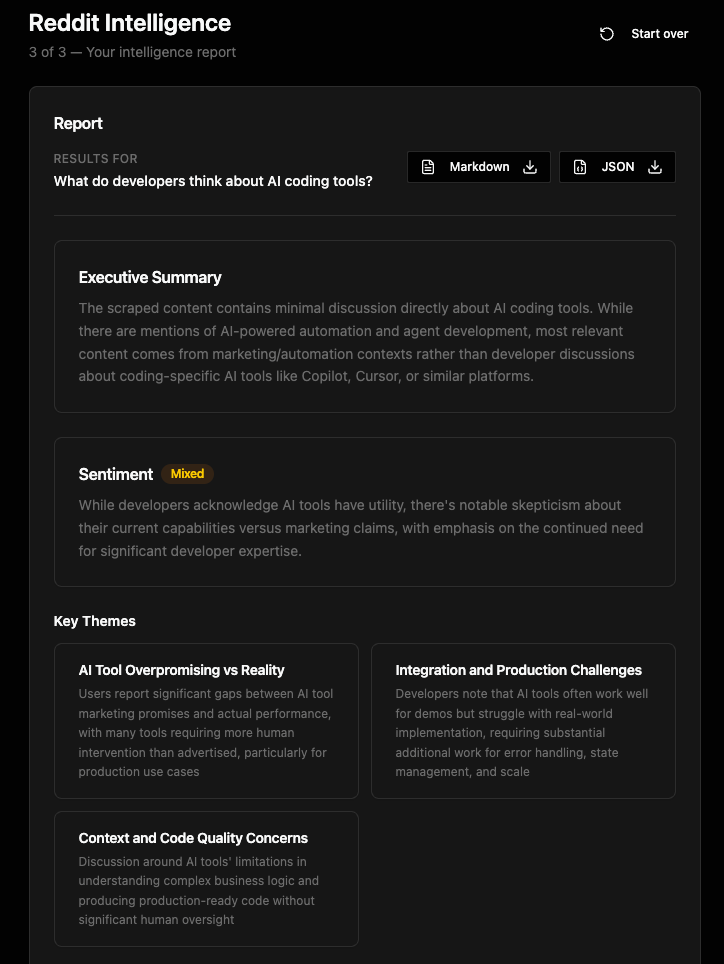

# Reddit Scraper

[](https://discord.gg/Ja8dqKgvbZ)


<p align="center">
<a href="https://dashboard.decodo.com/scrapers/pricing?utm_source=github&utm_medium=social&utm_campaign=webscrapingapi"></a>
</p>

Reddit Scraper is an open-source Reddit scraping and intelligence tool that collects subreddit posts and comments from any topic or search query, then generates AI-powered reports with sentiment analysis, key themes, notable quotes, and top post rankings.

Built for developers, marketers, founders, and researchers, it combines [Decodo Web Scraping API](https://decodo.com/scraping/web) with LLM-based analysis to turn raw Reddit discussions into structured, actionable insights without manual browsing.

## Features

- **Scrape subreddits, posts, and comments**. Collect Reddit discussions from any topic, keyword, or search query.
- **AI-powered executive summaries**. Generate structured overviews of what Reddit users are saying.
- **Sentiment analysis**. Understand whether discussions are positive, negative, or mixed.
- **Key theme extraction**. Identify recurring talking points and dominant discussion patterns.
- **Notable quotes and insights**. Surface representative or impactful Reddit comments automatically.
- **Top post ranking**. Highlight the most relevant and upvoted posts across scraped results.
- **Markdown and JSON export**. Download structured reports for further analysis or sharing.

## How it works

1. **Enter a topic**. Provide a prompt or research question such as "What do developers think about AI coding tools?".

2. **Adjust analysis options**. Optionally specify subreddits, choose a time range, and control how many Reddit posts should be analyzed.

3. **Review the scraping plan**. The LLM suggests relevant subreddits and search queries before scraping begins. You can review and edit the generated plan before running it.

4. **Generate an intelligence report**. Reddit posts and comments are scraped through the Decodo Web Scraping API, then analyzed by the LLM to produce a structured report with summaries, themes, sentiment analysis, notable quotes, and top discussions.

5. **Export the results**. Download the generated report as Markdown or JSON for further analysis, reporting, or sharing.

## Example report

<details>
<summary>View example JSON report snippet</summary>

```json
{
  "id": "6a10077369749f74ff595437",
  "plan": {
    "prompt": "What do developers think about AI coding tools?",
    "subreddits": [
      "webscraping",
      "llms",
      "automation",
      "MachineLearning"
    ],
    "queries": [
      "What do developers think about AI coding tools?",
      "\"AI coding tools\"",
      "developers opinion AI"
    ],
    "timeRange": "month",
    "maxPosts": 50
  },
  "posts": [
    {
      "id": "1px1agd",
      "title": "[D] r/MachineLearning - a year in review",
      "subreddit": "MachineLearning",
      "author": "Everlier",
      "upvotes": 202,
      "commentCount": 16,
      "url": "https://www.reddit.com/r/MachineLearning/comments/1px1agd/d_rmachinelearning_a_year_in_review/",
      "selftext": "This is a review of most upvoted posts on this sub in 2025, loosely grouped into high-level themes...",
      "createdAt": 1766851467
    },
    {
      "id": "1tibgp5",
      "title": "I built klura, a toolkit for an AI agent to reverse-engineer websites",
      "subreddit": "webscraping",
      "author": "rundfunk",
      "upvotes": 50,
      "commentCount": 19,
      "url": "https://github.com/klura-ai/klura",
      "selftext": "I've been working on klura — a free toolkit that gives a coding agent the ability to reverse-engineer a website...",
      "createdAt": 1779252926
    },
    {
      "id": "1qhbbll",
      "title": "Software development ISN'T CHEAP! You might have unrealistic expectations for AI systems.",
      "subreddit": "automation",
      "author": "kshoneesh_chaudhary",
      "upvotes": 10,
      "commentCount": 14,
      "url": "https://www.reddit.com/r/automation/comments/1qhbbll/software_development_isnt_cheap_you_might_have/",
      "selftext": "AI has made it easier to build software, but it’s not as if you can magically do months worth of coding in days...",
      "createdAt": 1768845240
    },
    {
      "id": "1t9q58x",
      "title": "🚨 Scrapling v0.4.8 is out with a new insane update🕷️",
      "subreddit": "webscraping",
      "author": "0xReaper",
      "upvotes": 187,
      "commentCount": 16,
      "url": "https://github.com/D4Vinci/Scrapling/releases/tag/v0.4.8",
      "selftext": "Introducing the new spiders templates feature to make generic spiders easier...",
      "createdAt": 1778466134
    }
  ]
}
```

</details>

<details>
<summary>View example report interface</summary>
<p align="left">
  
</p>
</details>

## Prerequisites

- [Bun](https://bun.sh) version 1.2.5 or newer
- [Docker](https://docker.com) for running local MongoDB and Redis instances
- A Decodo Web Scraping API token – create an account at [dashboard.decodo.com](https://dashboard.decodo.com/register?page=scrapers/pricing)
- At least one supported LLM provider API key:
  - Anthropic
  - OpenAI
  - Google Gemini

> If you've just installed Bun, open a new terminal window or reload your shell configuration before running `bun install`.
>
> Example:
> - zsh: `source ~/.zshrc`
> - bash: `source ~/.bashrc`


## Installation

### 1. Clone the repository

```bash
git clone https://github.com/Decodo/reddit-scraper
cd reddit-scraper
```

### 2. Install dependencies

```bash
bun install
```

### 3. Configure environment variables

```bash
cp .env.example .env
```

Add your:
- Decodo API token
- LLM provider selection
- Anthropic, OpenAI, or Gemini API key

### 4. Start local databases

```bash
bun db:up
```

This starts MongoDB and Redis through Docker Compose.

### 5. Start the Reddit Scraper

```bash
bun dev
```

Frontend:

```text
http://localhost:5274
```

Backend API:

```text
http://localhost:5002
```

## Configuration

After creating your `.env` file during installation, add your API credentials and provider settings:

```env
# Decodo Scraping API
DECODO_BASIC_AUTH_TOKEN=your_decodo_token

# LLM provider (claude | openai | gemini)
LLM_PROVIDER=claude
LLM_MODEL=

# LLM API keys
ANTHROPIC_API_KEY=sk-ant-...
OPENAI_API_KEY=sk-...
GEMINI_API_KEY=AIza...
```

### Environment variables

| Variable | Description |
| --- | --- |
| `DECODO_BASIC_AUTH_TOKEN` | Decodo Scraping API authentication token |
| `LLM_PROVIDER` | LLM provider to use (`claude`, `openai`, or `gemini`) |
| `LLM_MODEL` | Optional custom model override |
| `ANTHROPIC_API_KEY` | Anthropic API key |
| `OPENAI_API_KEY` | OpenAI API key |
| `GEMINI_API_KEY` | Google Gemini API key |

## Scripts

| Command | Description |
| --- | --- |
| `bun dev` | Start frontend and backend development servers |
| `bun build` | Build all application packages |
| `bun lint` | Run linting across all packages |
| `bun db:up` | Start MongoDB and Redis via Docker Compose |
| `bun db:down` | Stop local database containers |

## Tech stack

| Layer | Technology |
| --- | --- |
| Frontend | React 19, TanStack Router, TanStack Query, Tailwind CSS v4, Radix UI |
| Backend | NestJS 11, MongoDB, Mongoose |
| Scraping | Decodo Web Scraping API |
| LLMs | Anthropic Claude, OpenAI GPT, Google Gemini |

## Project structure

```text
.github/
  images/         # README screenshots and repository assets

apps/
  frontend/
    src/
      features/
        tracker/      # Prompt flow, report generation, API hooks
        queries/      # Query history features
        settings/     # Runtime settings and API key management

      routes/
        _layout/
          tracker.tsx
          history.tsx
          history.$id.tsx
          settings.tsx

  backend/
    src/
      features/
        tracker/      # Scraping and report generation endpoints
        decodo/       # Decodo Web Scraping API integration
        llm/          # Claude, OpenAI, and Gemini abstraction layer
        queries/      # Query history persistence
        settings/     # Runtime provider and API configuration

  shared/
    # Shared TypeScript types

docs/
```

## Documentation

For additional information about scraping targets, parameters, and API behavior, see the [Decodo Web Scraping API documentation](https://help.decodo.com/docs/web-scraping-api-introduction).

## API endpoints

| Method | Path | Description |
| --- | --- | --- |
| POST | `/tracker/plan` | Generate a scraping plan from a user prompt |
| POST | `/tracker/analyze` | Scrape Reddit and generate an AI report |
| GET | `/queries` | List saved query history |
| GET | `/queries/:id` | Retrieve a full query result |
| DELETE | `/queries/:id` | Delete a saved query |
| GET | `/settings` | Retrieve current provider and API key status |
| PATCH | `/settings` | Update API keys or LLM provider |

## Scraping strategy

Each analysis combines three Decodo scraping targets to collect Reddit data at different levels:

| Step | Target | Purpose |
| --- | --- | --- |
| 1 | `universal` | Search Reddit globally across multiple subreddits |
| 2 | `reddit_subreddit` | Collect trending and relevant subreddit posts |
| 3 | `reddit_post` | Extract full comment threads for deeper analysis |

The LLM generates relevant subreddits and search queries based on the user's prompt. Up to 30 posts are collected, deduplicated, and ranked by engagement before the top results are scraped with full comment threads for AI-powered analysis and summarization.

## Related repositories

- [Decodo Web Scraping API](https://github.com/Decodo/Web-Scraping-API)
- [Decodo SDK for TypeScript](https://github.com/Decodo/sdk-ts)
- [Decodo MCP Server](https://github.com/Decodo/mcp-server)
- [Decodo OpenClaw Skill](https://github.com/Decodo/decodo-openclaw-skill) 

## License

MIT — see [LICENSE](LICENSE)
